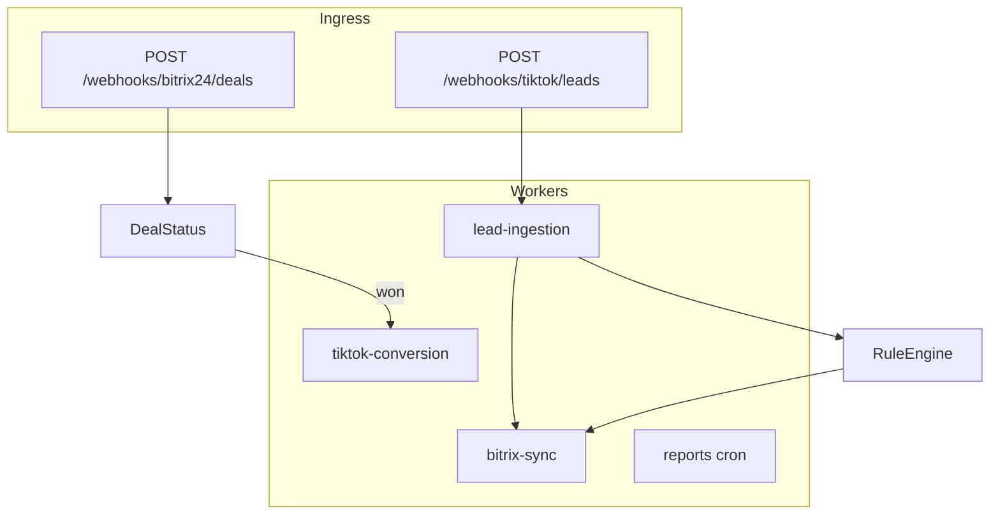
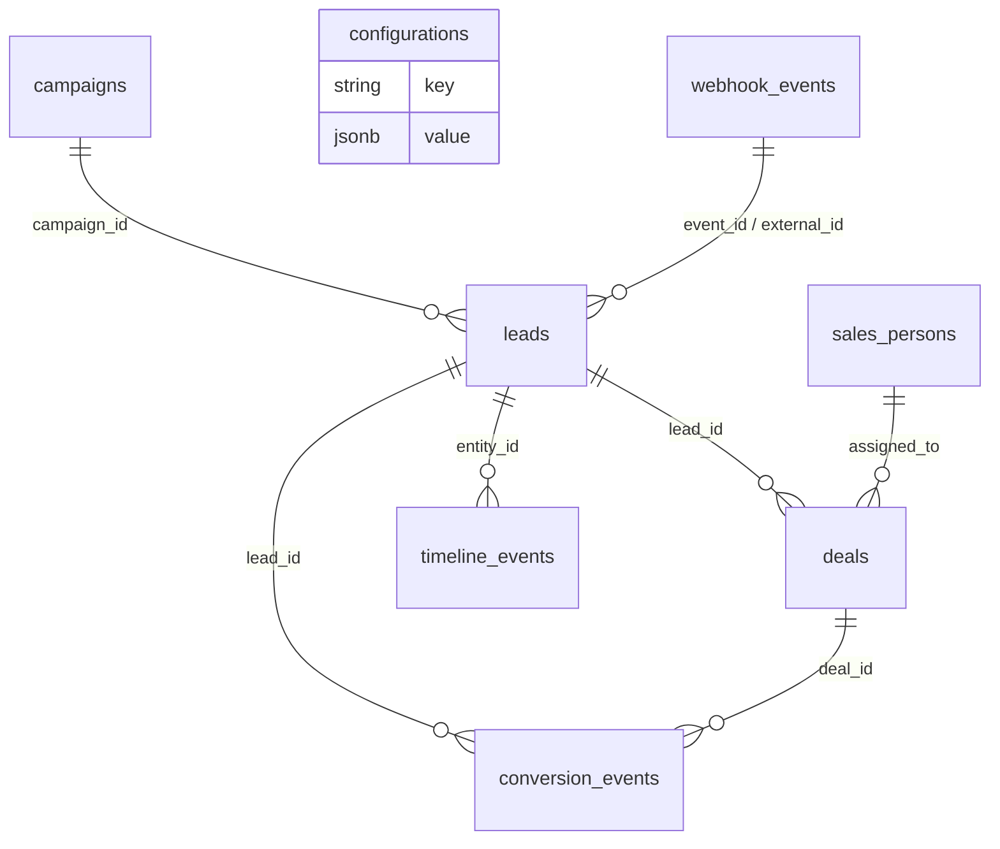

# TikTok Lead Generation × Bitrix24 CRM

Nền tảng NestJS tự động thu thập lead từ TikTok Lead Generation Forms, chuẩn hóa / khử trùng / chấm điểm, đồng bộ Bitrix24 CRM, convert Lead → Deal theo rule engine, rồi trả analytics + báo cáo.

Đề bài tuyển dụng được implement **đủ 3 module chức năng**, **đủ công nghệ bắt buộc**, và **các hạng mục điểm cộng** (Docker multi-stage, Jest, ESLint/Prettier/Husky, mock TikTok/Bitrix24).

---

## 1. Demo nhanh (5 phút)

```bash
cp .env.example .env
docker compose up --build
docker compose exec api npm run seed
docker compose exec api npm run mock:tiktok
```

Sau đó mở:

| Mục | URL |
| --- | --- |
| Cấu hình / mapping | http://localhost:3000 |
| Swagger UI | http://localhost:3000/docs |
| OpenAPI JSON | http://localhost:3000/docs/swagger.json |
| Health | http://localhost:3000/health |
| Conversion rates | http://localhost:3000/api/v1/analytics/conversion-rates |
| Bitrix24 mock log | http://localhost:4002/_debug/calls |

Cấu hình và mapping xem/sửa qua API (đúng đề bài, không có màn admin riêng):

```http
GET  /api/v1/config/mappings
PUT  /api/v1/config/mappings
GET  /api/v1/config/rules
PUT  /api/v1/config/rules
```

Chạy không Docker (cần Postgres 16 + Redis 7 local):

```bash
cp .env.example .env
npm install
npm run migration:run
npm run seed
npm run start:dev
npm run mock:bitrix
npm run mock:tiktok
```

---

## 2. Mapping tiêu chí đánh giá

### Chức năng & logic (35%)

| Yêu cầu đề bài | Implementation |
| --- | --- |
| Webhook TikTok + `TikTok-Signature` | `TikTokSignatureService` — HMAC-SHA256 `t=<ts>,s=<hex>`, replay window 300s, so sánh timing-safe |
| Event `lead.generate` / `form.complete` / `user.interaction` | `LeadNormalizerService` whitelist 3 event |
| Lưu raw data audit | Bảng `webhook_events` (payload + headers + `signature_valid`) |
| Validate / sanitize | HTML/control-char strip, class-validator DTO |
| Chuẩn hóa phone/email | `libphonenumber-js` → E.164, email lowercase RFC-like |
| Phân loại theo campaign/ad/form | Cột `campaign_id`, `ad_id`, `form_id` + bảng `campaigns` |
| Dedup email/phone | Tìm lead active theo `email_normalized` **hoặc** `phone_e164`, merge strategy |
| Tạo/cập nhật Lead Bitrix24 | `BitrixSyncService` + mock REST `crm.lead.add/update` |
| Field mapping linh hoạt | `GET/PUT /api/v1/config/mappings` |
| Merge + timeline + source tracking | `LeadMergeService`, bảng `timeline_events` |
| Rule engine Lead → Deal | `RuleEngineService` (CONTAINS/EQUALS/AND/OR/IN/…) |
| Pipeline + probability | Seed `pipeline` + rule `probability` |
| Auto-assign sales | `AssignmentService` (rule + capacity + least-loaded fallback) |
| Notification | `NotificationsService` (log hoặc outbound webhook) |
| Conversion / CPL / ROI / quality | `AnalyticsService` + cache Redis 30–60s |
| Export CSV/Excel/JSON | `GET /api/v1/reports/export?format=csv&date_range=30d` |
| Sync conversion về TikTok | Queue `tiktok-conversion` khi Deal **won** |
| Batch historical migration | `POST /api/v1/leads/batch-import` |
| Scheduled reports + alerts | BullMQ repeatable: daily report 08:00, stale-lead mỗi giờ |

### Kiến trúc & code quality (25%)

- NestJS 11, module theo bounded context: `webhooks`, `leads`, `deals`, `sync`, `configuration`, `analytics`, `reports`, `queue`.
- DI / Guards (`ApiKeyGuard`, `ThrottlerGuard`) / Interceptors (logging + envelope) / Filters (standardized error).
- PostgreSQL schema có index trên email, phone, campaign, status, created_at; unique `event_id`.
- Pino structured logging + error stack cho 5xx.

### Công nghệ & performance (20%)

- TypeScript `strict`.
- Redis: cache mapping/rules/dashboard + BullMQ prefix `tb24`.
- Retry exponential + bảng `dead_letter_jobs` khi hết attempts.
- Rate limit: 100 req/phút global, 300 webhook, 10 export.
- Swagger/OpenAPI tại `/docs`.

### Testing & documentation (20%)

```bash
npm test
npm run test:cov
npm run test:e2e
```

Coverage threshold trong `jest.config.ts`: statements/lines/functions **80%**.

---

## 3. Kiến trúc (tóm tắt)

Xem sơ đồ đầy đủ trong [docs/ARCHITECTURE.md](docs/ARCHITECTURE.md).



**Quyết định kỹ thuật quan trọng**

1. **Raw body cho chữ ký** — Nest `rawBody: true`. Không `JSON.stringify` lại payload khi verify; TikTok ký đúng bytes đã gửi.
2. **Queue-first ingestion** — Webhook chỉ verify + persist + enqueue (201 nhanh). CRM latency không chặn TikTok retry.
3. **Local DB là source of truth** — Bitrix24 là projection. Nếu CRM down, lead vẫn tồn tại và retry.
4. **Mock-first** — Đề bài cho phép mock. `mocks/bitrix24` và `mocks/tiktok` implement CRUD/Events API đủ để demo end-to-end không cần tài khoản thật.
5. **Rule engine text DSL** — Giữ đúng format đề bài (`campaign.campaign_name CONTAINS 'sale'`) thay vì nhốt rule trong code.
6. **TypeORM + migrations** — `synchronize` tắt mặc định; `migrationsRun` bật khi start (trừ `NODE_ENV=test`).

---

## 4. Database

Schema mở rộng so với đề bài (đủ audit, scoring, sync, DLQ) nhưng **giữ nguyên** các bảng bắt buộc `leads`, `deals`, `configurations`.

Migration: `src/database/migrations/1700000000000-InitSchema.ts`

ERD:



---

## 5. API (đúng path đề bài)

| Method | Path | Ghi chú |
| --- | --- | --- |
| POST | `/webhooks/tiktok/leads` | Header `TikTok-Signature` |
| POST | `/webhooks/bitrix24/deals` | Webhook Deal Bitrix24 |
| GET | `/api/v1/leads?page=1&limit=10&source=tiktok` | |
| GET | `/api/v1/deals?status=open&assigned_to=user_id` | |
| POST | `/api/v1/leads/:id/convert-to-deal` | |
| GET/PUT | `/api/v1/config/mappings` | Body/response: `{ "field_mapping": { ... } }` |
| GET/PUT | `/api/v1/config/rules` | Body/response: `{ "deal_rules": [ ... ] }` |
| GET | `/api/v1/analytics/conversion-rates` | |
| GET | `/api/v1/analytics/campaign-performance` | |
| GET | `/api/v1/reports/export?format=csv&date_range=30d` | |
| GET | `/health` | Demo requirement |

Bổ sung hữu ích: `GET /api/v1/analytics/dashboard`, `POST /api/v1/leads/batch-import`, `PATCH /api/v1/deals/:id/status`, `POST /api/v1/leads/:id/sync`.

### Ví dụ webhook đã ký

```bash
npm run mock:tiktok
# hoặc
EVENT_ID=evt_demo npm run mock:tiktok
```

Script đọc `mocks/sample-payloads/lead.generate.json` (payload chuẩn đề bài), gắn `TikTok-Signature` và POST tới API.

---

## 6. Field mapping & deal rules (seed)

Seed ghi đúng config mẫu của đề bài:

```json
{
  "field_mapping": {
    "lead_data.full_name": "NAME",
    "lead_data.email": "EMAIL[0][VALUE]",
    "lead_data.phone": "PHONE[0][VALUE]",
    "lead_data.city": "UF_CRM_CITY",
    "campaign.campaign_name": "UF_CRM_UTM_CAMPAIGN",
    "campaign.ad_name": "UF_CRM_AD_NAME",
    "lead_data.ttclid": "UF_CRM_TTCLID"
  },
  "deal_rules": [
    {
      "condition": "campaign.campaign_name CONTAINS 'sale'",
      "action": "create_deal",
      "pipeline_id": "1",
      "stage_id": "NEW",
      "probability": 30
    }
  ]
}
```

Campaign mẫu **Spring Sale 2024** sẽ tự convert thành Deal (rule CONTAINS `'sale'`), assign `sp_hanoi` vì city = Hà Nội.

---

## 7. Testing

```bash
npm test              # unit
npm run test:cov      # coverage (threshold 80%)
npm run test:e2e      # webhook + leads HTTP
npm run lint
npm run format
```

Unit test cover: chữ ký TikTok, normalize phone/email, field mapper, rule engine (đúng sample payload), quality score, merge/dedup, assignment, Bitrix sync, export, guards/filters.

---

## 8. Cấu trúc thư mục

```text
src/
  common/          guards, filters, interceptors, utils
  config/          env + Joi validation
  database/        entities, migrations, seeds
  integrations/    TikTok signature/events, Bitrix24 REST client
  modules/         leads, deals, webhooks, analytics, reports, config
  queue/           processors + DLQ + schedulers
  cache/           Redis cache
mocks/             Bitrix24 + TikTok mock servers + sample payload
scripts/           send signed webhook, export swagger
docs/              architecture, deployment
```

---

## 9. Production improvements (đề xuất)

1. **Outbox pattern** — ghi event sync trong cùng transaction với lead, worker đọc outbox thay vì fire-and-forget queue ngay trong request path.
2. **Idempotent Bitrix writes** — lưu `external_id` vào UF field và search trước khi `crm.lead.add` (tránh double-create khi retry).
3. **TikTok official signature** — khi có app thật, xác nhận format header hiện tại của Marketing API (một số app dùng `sha256=` thuần). Adapter đã tách trong `TikTokSignatureService`.
4. **PII** — encrypt email/phone at rest (pgcrypto / application envelope), mask trong log.
5. **Observability** — OpenTelemetry + Prometheus metrics (`lead_ingest_total`, `bitrix_sync_latency`, queue depth).
6. **Multi-tenant** — `advertiser_id` thành tenant key, mapping/rules theo advertiser.
7. **Auth nâng cao** — JWT/OIDC cho dashboard, API key chỉ cho service-to-service.
8. **Horizontal scale** — tách `api` và `worker` process; Redis BullMQ đã sẵn sàng cho nhiều replica.

---

## 10. Troubleshooting

Xem [docs/DEPLOYMENT.md](docs/DEPLOYMENT.md).

Lỗi phổ biến:

- `Invalid TikTok signature` → sai `TIKTOK_APP_SECRET` hoặc proxy rewrite body.
- Webhook 201 nhưng chưa có lead → Redis/BullMQ chưa lên; xem `dead_letter_jobs`.
- Bitrix fail → `GET http://localhost:4002/_debug/calls` hoặc `bitrix24SyncError` trên lead.

---

## License

UNLICENSED — bài dự tuyển, không phát hành công khai.
