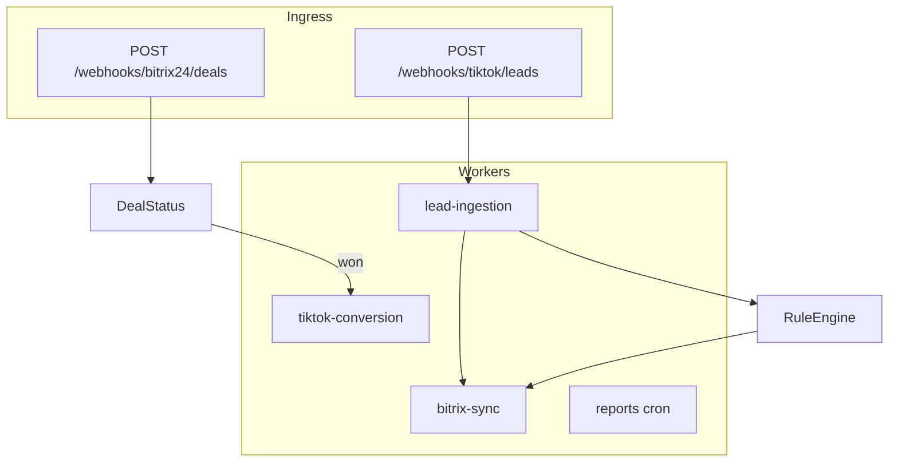
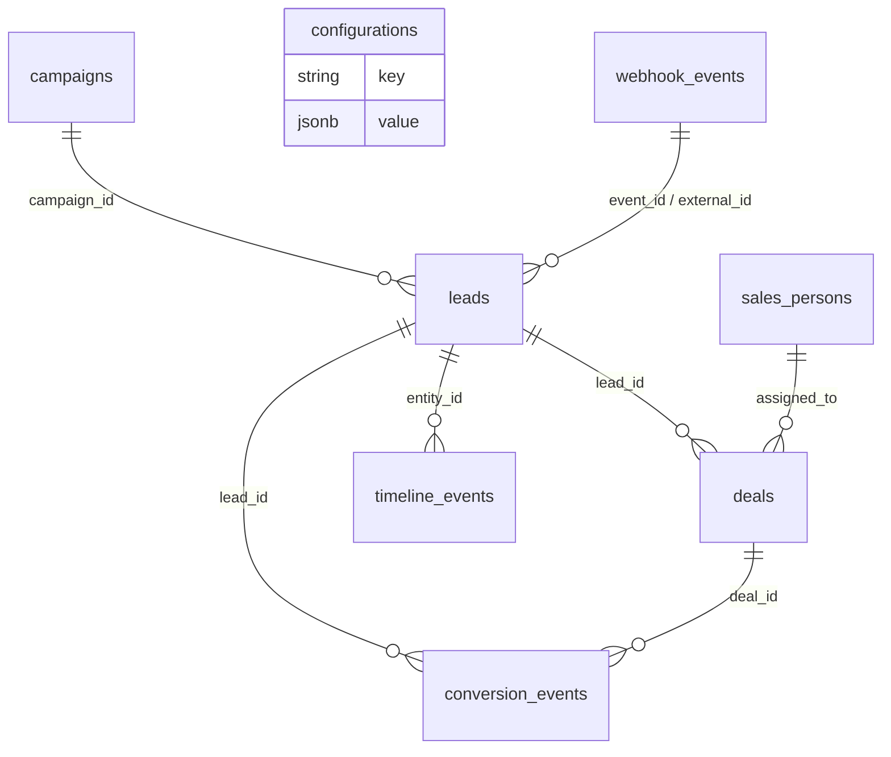

# TikTok Lead Generation × Bitrix24 CRM

NestJS: TikTok Lead webhook → chuẩn hóa/dedup → Bitrix24 → Rule Engine → Deal → analytics.

- API: [docs/USAGE.md](docs/USAGE.md)
- Kiến trúc: [docs/ARCHITECTURE.md](docs/ARCHITECTURE.md)
- Deploy: [docs/DEPLOYMENT.md](docs/DEPLOYMENT.md)

---

## 1. Cài đặt và chạy

### Yêu cầu

| Thành phần | Ghi chú |
| --- | --- |
| Docker Desktop / Docker Engine | Bắt buộc cho Cách A; dùng cho Postgres/Redis ở Cách B |
| Node.js 22+ | Chỉ cần ở Cách B (chạy API trên máy) |
| Git | Clone repo |

### Cách A — Docker

```bash
git clone <repo-url>
cd v2_3
cp .env.example .env
docker compose up --build
```

Khi API đã lên:

```bash
docker compose exec api npm run seed
docker compose exec api npm run mock:tiktok
```

### Cách B — API trên máy + Postgres/Redis Docker

```bash
git clone <repo-url>
cd v2_3
cp .env.example .env
npm install
npm run infra:up
npm run migration:run
npm run seed
npm run start:dev
```

Terminal khác:

```bash
npm run mock:bitrix
npm run mock:tiktok
```

### URL sau khi chạy

| Mục | URL |
| --- | --- |
| Mapping | http://localhost:3000 |
| Swagger | http://localhost:3000/docs?api_key=change-me-to-a-strong-random-key |
| Health | http://localhost:3000/health |
| Analytics | http://localhost:3000/api/v1/analytics/conversion-rates |
| Bitrix mock | http://localhost:4002/_debug/calls |

### API key

Mọi `/api/v1/*` và `/docs` cần header:

```http
x-api-key: change-me-to-a-strong-random-key
```

Giá trị = `API_KEY` trong `.env`. Webhook TikTok/Bitrix24 và `/health` không cần.

```bash
curl -s -H "x-api-key: change-me-to-a-strong-random-key" http://localhost:3000/api/v1/config/mappings
```

### Mapping / rules

```http
GET  /api/v1/config/mappings
PUT  /api/v1/config/mappings
GET  /api/v1/config/rules
PUT  /api/v1/config/rules
```

### Lệnh

| Lệnh | Việc làm |
| --- | --- |
| `npm run setup` | Tạo `.env` từ `.env.example` |
| `npm run infra:up` | Bật Postgres + Redis |
| `npm run infra:down` | Tắt Postgres + Redis |
| `npm run start:dev` | Chạy API (watch) |
| `npm run seed` | Seed dữ liệu |
| `npm test` | Unit test |
| `npm run test:e2e` | E2E test |
| `docker compose down` | Tắt full stack |

### Lỗi thường gặp

| Lỗi | Xử lý |
| --- | --- |
| `ECONNREFUSED` Redis/Postgres | `npm run infra:up` |
| `401 Invalid or missing API key` | Gửi `x-api-key` đúng `API_KEY` trong `.env` |
| `docker` not found | Cài Docker, mở lại terminal |
| Port 5432/6379 bận | Đổi `DB_PORT` / `REDIS_PORT` trong `.env` |

---

## 2. Mapping tiêu chí đánh giá

### Chức năng & logic (35%)

| Yêu cầu đề bài | Implementation |
| --- | --- |
| Webhook TikTok + `TikTok-Signature` | `TikTokSignatureService` — HMAC-SHA256 `t=<ts>,s=<hex>`, replay window 300s, so sánh timing-safe |
| Event `lead.generate` / `form.complete` / `user.interaction` | `LeadNormalizerService` whitelist 3 event |
| Lưu raw data audit | Bảng `webhook_events` (payload + headers + `signature_valid`) |
| Validate / sanitize | HTML/control-char strip, class-validator DTO |
| Chuẩn hóa phone/email | `libphonenumber-js` → E.164, email lowercase RFC-like |
| Phân loại theo campaign/ad/form | Cột `campaign_id`, `ad_id`, `form_id` + bảng `campaigns` |
| Dedup email/phone | Tìm lead active theo `email_normalized` **hoặc** `phone_e164`, merge strategy |
| Tạo/cập nhật Lead Bitrix24 | `BitrixSyncService` + mock REST `crm.lead.add/update` |
| Field mapping linh hoạt | `GET/PUT /api/v1/config/mappings` |
| Merge + timeline + source tracking | `LeadMergeService`, bảng `timeline_events` |
| Rule engine Lead → Deal | `RuleEngineService` (CONTAINS/EQUALS/AND/OR/IN/…) |
| Pipeline + probability | Seed `pipeline` + rule `probability` |
| Auto-assign sales | `AssignmentService` (rule + capacity + least-loaded fallback) |
| Direct manager + edit-before-approve | `WorkflowService`: snapshot `managerExternalId`, `GET /deals/:id/workflow`, submit/approve; khóa sửa sau phê duyệt cuối; `won` bắt buộc approved |
| Notification | `NotificationsService` (log hoặc outbound webhook) |
| Conversion / CPL / ROI / quality | `AnalyticsService` + cache Redis 30–60s |
| Export CSV/Excel/JSON | `GET /api/v1/reports/export?format=csv&date_range=30d` |
| Sync conversion về TikTok | Queue `tiktok-conversion` khi Deal **won** |
| Batch historical migration | `POST /api/v1/leads/batch-import` |
| Scheduled reports + alerts | BullMQ repeatable: daily report 08:00, stale-lead mỗi giờ |

### Kiến trúc & code quality (25%)

- NestJS 11, module theo bounded context: `webhooks`, `leads`, `deals`, `sync`, `configuration`, `analytics`, `reports`, `queue`.
- DI / Guards: `ThrottlerGuard` **và** `ApiKeyGuard` là `APP_GUARD` toàn cục; **đồng thời `@UseGuards(ApiKeyGuard)` trên từng controller** (leads/deals/config/analytics/reports/webhooks). Webhook + health dùng `@Public()`. ValidationPipe `whitelist` + `forbidNonWhitelisted`. Interceptors (logging + envelope) / Filters (standardized error).
- PostgreSQL schema có index trên email, phone, campaign, status, created_at; unique `event_id`.
- Pino structured logging + error stack cho 5xx.

### Công nghệ & performance (20%)

- TypeScript `strict`.
- Redis: cache mapping/rules/dashboard + BullMQ prefix `tb24`.
- Retry exponential + bảng `dead_letter_jobs` khi hết attempts.
- Rate limit: 100 req/phút global, 300 webhook, 10 export.
- Swagger/OpenAPI tại `/docs`.

### Testing & documentation (20%)

```bash
npm test
npm run test:cov
npm run test:e2e
```

Coverage threshold trong `jest.config.ts`: statements/lines/functions **80%**.

---

## 3. Kiến trúc (tóm tắt)

Xem sơ đồ đầy đủ trong [docs/ARCHITECTURE.md](docs/ARCHITECTURE.md).



1. **Raw body cho chữ ký** — Nest `rawBody: true`. Không `JSON.stringify` lại payload khi verify; TikTok ký đúng bytes đã gửi.
2. **Queue-first ingestion** — Webhook chỉ verify + persist + enqueue (201 nhanh). CRM latency không chặn TikTok retry.
3. **Local DB là source of truth** — Bitrix24 là projection. Nếu CRM down, lead vẫn tồn tại và retry.
4. **Mock-first** — `mocks/bitrix24` và `mocks/tiktok` đủ demo end-to-end không cần tài khoản thật.
5. **Rule engine text DSL** — `campaign.campaign_name CONTAINS 'sale'`.
6. **TypeORM + migrations** — `synchronize` tắt mặc định; `migrationsRun` bật khi start (trừ `NODE_ENV=test`).

---

## 4. Database

Migration: `src/database/migrations/1700000000000-InitSchema.ts`, `1700000000001-ApprovalWorkflow.ts`.



---

## 5. API

| Method | Path | Auth |
| --- | --- | --- |
| POST | `/webhooks/tiktok/leads` | TikTok-Signature |
| POST | `/webhooks/bitrix24/deals` | x-bitrix-secret |
| GET | `/api/v1/leads` | API key |
| GET | `/api/v1/deals` | API key |
| POST | `/api/v1/leads/:id/convert-to-deal` | API key |
| GET/PUT | `/api/v1/config/mappings` | API key |
| GET/PUT | `/api/v1/config/rules` | API key |
| GET | `/api/v1/analytics/conversion-rates` | API key |
| GET | `/api/v1/analytics/campaign-performance` | API key |
| GET | `/api/v1/reports/export` | API key |
| GET | `/health` | Public |
| GET | `/api/v1/deals/:id/workflow` | API key + `x-actor-id` |
| PATCH | `/api/v1/deals/:id` | API key + `x-actor-id` |
| POST | `/api/v1/deals/:id/submit-approval` | API key + `x-actor-id` |
| POST | `/api/v1/deals/:id/approve` | API key + `x-actor-id` |
| PATCH | `/api/v1/deals/:id/status` | API key |

```bash
npm run mock:tiktok
EVENT_ID=evt_demo npm run mock:tiktok
```

---

## 6. Field mapping & deal rules (seed)

```json
{
  "field_mapping": {
    "lead_data.full_name": "NAME",
    "lead_data.email": "EMAIL[0][VALUE]",
    "lead_data.phone": "PHONE[0][VALUE]",
    "lead_data.city": "UF_CRM_CITY",
    "campaign.campaign_name": "UF_CRM_UTM_CAMPAIGN",
    "campaign.ad_name": "UF_CRM_AD_NAME",
    "lead_data.ttclid": "UF_CRM_TTCLID"
  },
  "deal_rules": [
    {
      "condition": "campaign.campaign_name CONTAINS 'sale'",
      "action": "create_deal",
      "pipeline_id": "1",
      "stage_id": "NEW",
      "probability": 30
    }
  ]
}
```

Campaign **Spring Sale 2024** → Deal, assign `sp_hanoi`, manager `sp_manager`. `won` chỉ sau khi manager approve.

---

## 7. Testing

```bash
npm test
npm run test:cov
npm run test:e2e
npm run lint
```

---

## 8. Cấu trúc thư mục

```text
src/
  common/          guards, filters, interceptors, utils
  auth/            ApiKeyGuard
  config/          env + Joi
  database/        entities, migrations, seeds
  integrations/    TikTok, Bitrix24
  modules/         leads, deals, webhooks, analytics, reports, config
  queue/           workers + DLQ
  cache/           Redis
mocks/
scripts/
docs/
```

---

## 9. Troubleshooting

| Lỗi | Xử lý |
| --- | --- |
| Invalid TikTok signature | Sai `TIKTOK_APP_SECRET` hoặc body bị rewrite |
| Webhook 201 nhưng chưa có lead | Redis/BullMQ; xem `dead_letter_jobs` |
| Bitrix fail | `http://localhost:4002/_debug/calls` |
| 401 API key | Thiếu/sai `x-api-key` |

Chi tiết: [docs/DEPLOYMENT.md](docs/DEPLOYMENT.md).

---

## License

UNLICENSED
