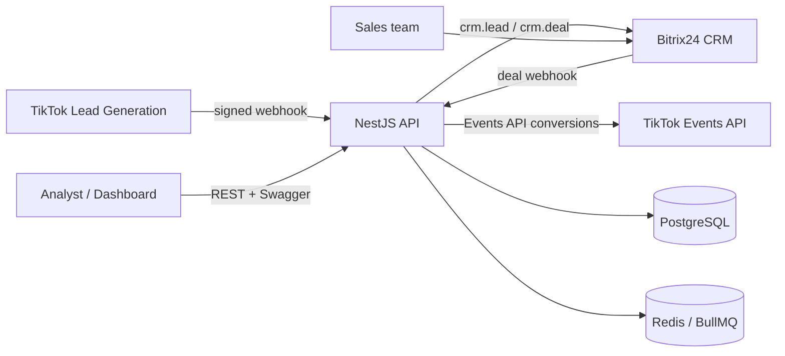
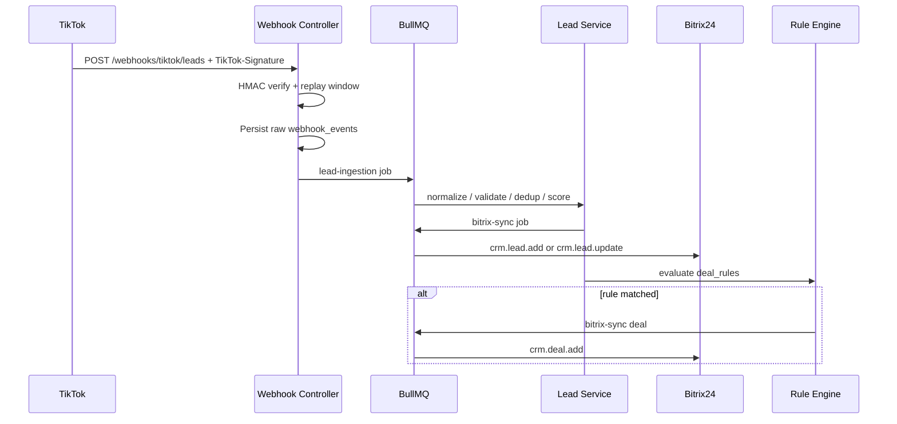

# Architecture

## System context

## Ingestion sequence

## Module map

| Module | Responsibility |
| --- | --- |
| `webhooks` | Public TikTok / Bitrix24 ingress, signature checks, raw audit |
| `leads` | Normalize, sanitize, deduplicate, quality score, merge |
| `deals` | Rule engine conversion, pipeline, assignment, won/lost |
| `sync` | Bitrix24 mapping + retryable CRM writes |
| `configuration` | Runtime field mapping and deal rules |
| `analytics` | Conversion, CPL, ROI, dashboard cache |
| `reports` | CSV/XLSX/JSON export, scheduled alerts |
| `queue` | Workers, retries, dead-letter table, cron |
| `cache` | Redis cache for config and analytics |

## Data integrity

- Webhook `event_id` is unique — replay is a no-op.
- Dedup key is normalized email **or** E.164 phone.
- Merge never drops previous `raw_data`; it keeps a rolling history.
- Bitrix24 writes are asynchronous; local `bitrix24_sync_status` is the source of truth until ACK.
- Failed jobs after max attempts land in `dead_letter_jobs`.
