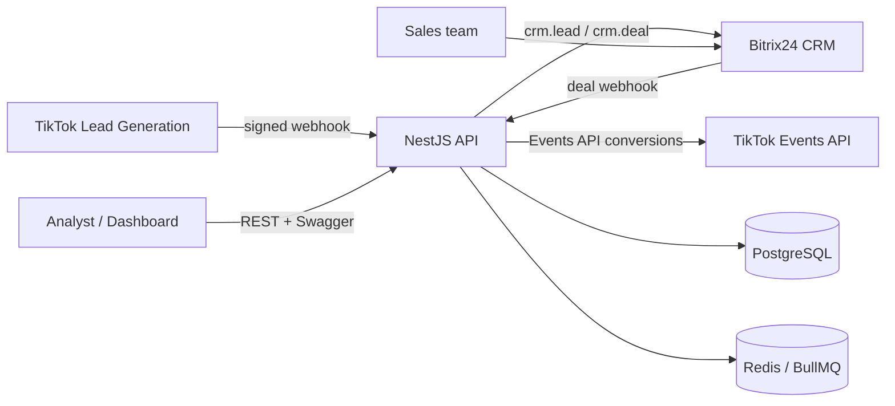
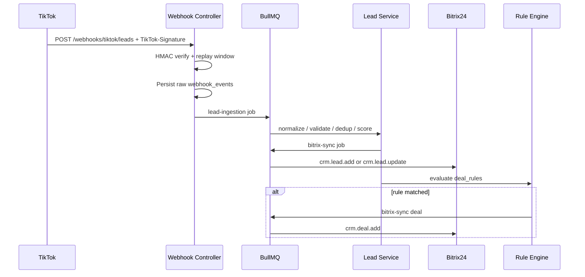
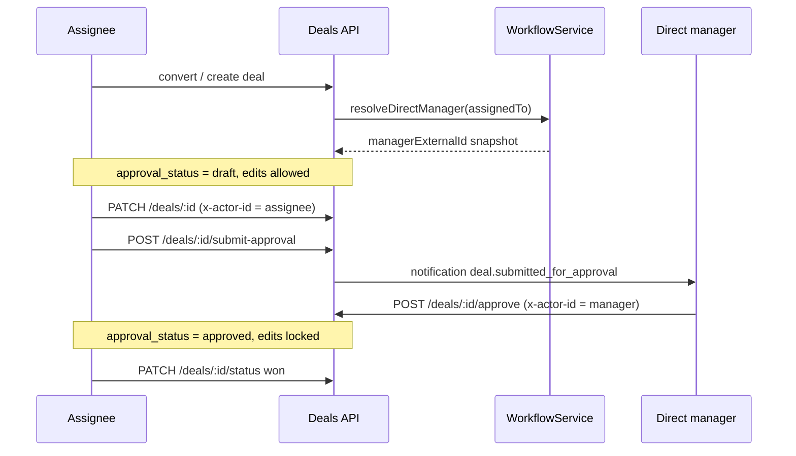

# Architecture

## System context

## Ingestion sequence

## Module map

| Module | Responsibility |
| --- | --- |
| `webhooks` | Public TikTok / Bitrix24 ingress, signature checks, raw audit |
| `leads` | Normalize, sanitize, deduplicate, quality score, merge |
| `deals` | Rule engine conversion, pipeline, assignment, approval workflow, won/lost |
| `auth` | `ApiKeyGuard` (global provider; applied with `@UseGuards` on protected controllers) |
| `sync` | Bitrix24 mapping + retryable CRM writes |
| `configuration` | Runtime field mapping and deal rules |
| `analytics` | Conversion, CPL, ROI, dashboard cache |
| `reports` | CSV/XLSX/JSON export, scheduled alerts |
| `queue` | Workers, retries, dead-letter table, cron |
| `cache` | Redis cache for config and analytics |

## Data integrity

- Webhook `event_id` is unique — replay is a no-op.
- Dedup key is normalized email **or** E.164 phone.
- Merge never drops previous `raw_data`; it keeps a rolling history.
- Bitrix24 writes are asynchronous; local `bitrix24_sync_status` is the source of truth until ACK.
- Failed jobs after max attempts land in `dead_letter_jobs`.

## Authentication and guards

- `ThrottlerGuard` and `ApiKeyGuard` are both global `APP_GUARD`s. Every controller also has `@UseGuards(ApiKeyGuard)`.
- Webhooks and health stay public via `@Public()`: TikTok signature and Bitrix `x-bitrix-secret` are **required**.
- `/docs` is Express middleware (not a Nest controller) so it is gated by `DocsAuthMiddleware`; it is disabled in production by default.
- Header: `x-api-key` or `Authorization: Bearer <API_KEY>`.
- CORS: `CORS_ORIGINS`. Empty list allows all origins in development and blocks cross-origin in production.
- Logging interceptor redacts `api_key` query values. Transform interceptor skips health, webhooks, export, and docs.
- Request bodies/query are validated by a global `ValidationPipe` (`whitelist` + `forbidNonWhitelisted`). Unknown fields and invalid enums return `400`.

## Deal approval workflow

Direct manager comes from `sales_persons.manager_external_id` of the assignee. Edit rights (`canEdit`) stay true until final approval. `won` is rejected until `approved`.
